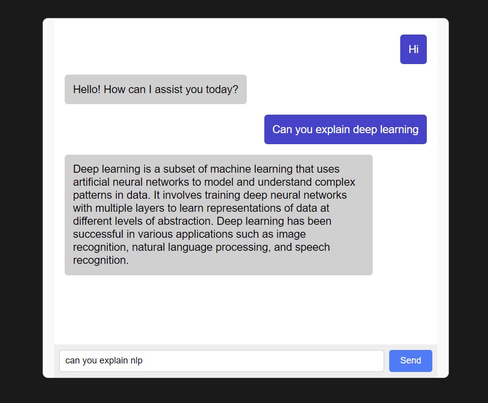

# AI Companion Project

---

## ✅ MVP Status – v1.0.0 (May 11, 2025)

🎉 The AI Companion MVP is complete!

This release delivers the first working version of a customizable AI assistant with:

- 💬 Real-time chat powered by OpenAI
- 🧠 Memory of prior interactions (SQLite)
- 🎭 Warm, supportive personality tone
- 🌐 Responsive web UI using React + FastAPI
- 🛠️ Modular architecture for future expansion

---

## 💬 Live Demo Preview



---


This project aims to develop an AI-powered emotional support and relationship simulation companion that users can interact with through natural conversations.

## 🚀 Project Overview

The AI Companion offers:
- Emotionally intelligent and context-aware conversations
- Customizable personalities and daily check-ins
- Lightweight memory for personalization
- A modular design ready for future expansion

## 📁 Project Structure

```
ai-companion-project/
├── .gitignore
├── LICENSE
├── README.md
├── requirements.txt
├── backend/
│   ├── main.py
│   ├── config.py
│   ├── routes/
│   │   └── chat.py
│   └── services/
│       ├── openai_service.py
│       └── memory.py
├── models/
│   ├── user.py
│   ├── chat.py
│   └── memory.py
├── tests/
│   ├── test_models.py
│   ├── test_chat.py
│   └── test_memory.py
├── data/
│   └── ai_companion.db
├── frontend/
│   ├── cli.py
│   └── web-ui/
│       ├── README.md
│       ├── eslint.config.js
│       ├── index.html
│       ├── package-lock.json
│       ├── package.json
│       ├── public/
│       │   └── vite.svg
│       ├── src/
│       │   ├── App.css
│       │   ├── App.jsx
│       │   ├── components/
│       │   │   ├── ChatApp.jsx
│       │   │   └── ChatApp.css
│       │   ├── assets/
│       │   │   └── react.svg
│       │   ├── index.css
│       │   └── main.jsx
│       └── vite.config.js
└── docs/
    ├── core_functionalities.md
    ├── mvp_specification.md
    ├── architecture.md
    └── COMMIT_CONVENTION.md
```

## 🔧 Setup Instructions

### 1. Clone or Download the Project

```bash
git clone https://github.com/shafin-jadavji/ai-companion.git
cd ai-companion
```

### 2. Create and Activate a Virtual Environment

```bash
# Create virtual environment
python -m venv venv

# Activate it
# On Windows
venv\Scripts\activate

# On Mac/Linux
source venv/bin/activate
```
---

If you’re using VS Code, it will detect the `venv` folder.  
Select the Python interpreter from the command palette if prompted.

### 3. Install Dependencies

```bash
pip install -r requirements.txt
```

### 4. Run the FastAPI App

```bash
uvicorn backend.main:app --reload
```

Ensure your backend is running at `http://127.0.0.1:8000`.
## 🖥️ Web UI Setup (React + Vite)

```bash
cd frontend/web-ui
npm install
npm run dev
```

The app will start at [http://localhost:5173](http://localhost:5173) by default.


## 📄 License

This project is licensed under the [MIT License](LICENSE).  
You are free to use, modify, and distribute this software with proper attribution.

## 🛣️ Next Steps

See [ROADMAP.md](ROADMAP.md) for planned features like:

- 🎙️ Voice interaction support  
- 🎭 AI name and tone customization  
- 🧑‍🎨 Avatar and emotion syncing  
- 🌐 Smart home and API integrations  
- 🔒 Memory opt-in controls and data reset

📈 For a categorized overview of what's being worked on, see the [Project Board Summary](docs/project_board.md).
